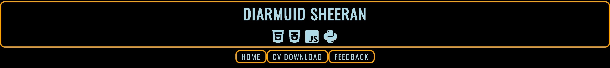
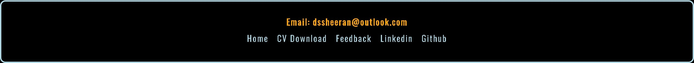
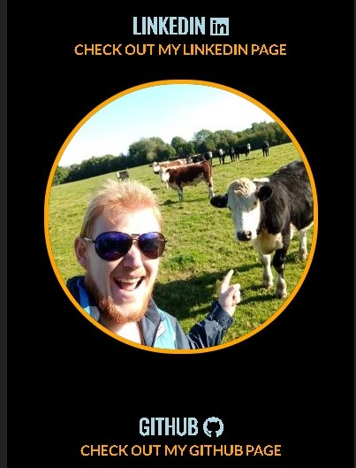
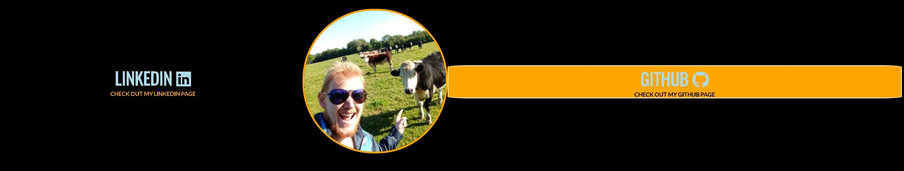
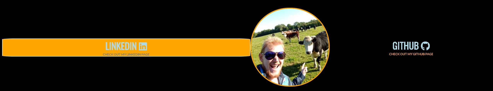

<h1>Diamruid Sheeran's Personal Profile</h1>

This is an about me personal profile website for me (Diarmuid Sheeran) to showcase some of my skills in a static HTML/CSS website.

The aim of the website is to give someone a brief introduction to what I am currently learning or have learned, and also give them an oppertunity to download and check out my CV.  
It will also give the user an oppertunity to leave feedback to me to help me improve my site.

<h1>Features</h1>
<ul>
    <li><h2>Navigation</h2>
        <ul>
            <li>Positioned in the center at the top of the page in the header: Diarmuid Sheeran provides a link to the home page.</li>
            <li>This Logo also outlines to the user my name and what languages i am currently studying with the additions of the font awesome symbols of HTML, CSS, Javascript and Python.</li>
            <li>Underneath that is a navigation bar positioned in the center of the page with three seperate links to the home page, a cv download page and a feedback form page.</li>
             
            <li>The footer at the bottom of the page contains all links provided in the website.  
            This allows users to navigate without having to return to the header of the page.</li>
            <li>The Footer also contains my email address allowing interested user a way of contacting me.
            </li>          
            
            <li>When viewing the site on a desktop monitor links are provided on both the left and right of the main section centered either side of the main section image. 
            These Links will open up either my Github page or my Linkedin Page in a new tab.</li>
            
            <li>When viewing the images on a mobile device a justify content wrap feature was used to position the contnet for the main section on top of one another for a more responsive design.</li>
            
            <li> All navigation is clealry named sized and styled for ease of use while navigating throught the site.</li>
        </ul>
    </li>
     
    <li><h2>Download Button</h2>
        <ul>
            <li>The purpose of the download button is to allow a user to download a copy my CV.</li>
            <li>I added a download link to a pdf file i saved in a folder called data.</li>
            <li>The download button was made large to emphasise the purpose of the download page and entice the user to download a copy of my CV.</li>
            <li>The download button changes it's properties when hovered over and the mouse cursor is changed to a pointer.</li>
            
            
        </ul>
    </li>
     
    <li><h2>Feedback Form</h2>
        <ul>
            <li>The feedback form allows the user to input their name, email and write in a text area to submit feedback on my work.</li>
            <li>There are 3 standered text input fields with 1 larger text area field</li>
            <li>There is a submit button underneath the input fields that allows the user to submit the data they have entered.</li>
            <li>When the submit button is hovered over its properties change and the mouse changes to a pointer.</li>
            
            
        </ul>
    </li>
    <li><h2>Transform and Transition Properties</h2>
        <ul>
            <li>To create a more interactive UI design some transorm and transition properties were added.</li>
            <li>The Github and Linkedin links will grow both left and right while keeping the text centered using a transition technique is css. </li>
            <li>Using hover:hover allows the user to not get these effects on smaller devices that dont have a mouse to hover over. This avoided any bad UI implications.</li>
            
            
            <li>When the page loads the about me section floats into position before doing a full 360 degree flip.</li>
            <li>This is achived by using keyframe, transform and translate3d in css.</li>
            <li>The aim of this is to instantly engage the user and create intreague about the site.</li>
            <li>Click the gif below for a demonstration.</li>
            
        </ul>
    </li>
 

<h1>Testing</h1>
<ul>
    <li>I tested the website worked on different web browsers such as Chrome, Edge and Firefox.</li>
    <li>I tested and confiremd the responsive nature of the site on different devices such a mobile device, a tablet and a desktop computer.</li>
    <li>I confirmed that the the navigation bars direct the user to the correct destination.</li>
    <li>I tested the download capabilities of my download link and confirmed that it downloads my CV.</li>
    <li>I confirmed that the Linkedin and the Github links take the user directly to my respective pages.</li>
    <li>I have tested the form and confirmed that it takes in inputs and submits it to the Code Institute form dump.</li>
</ul>

